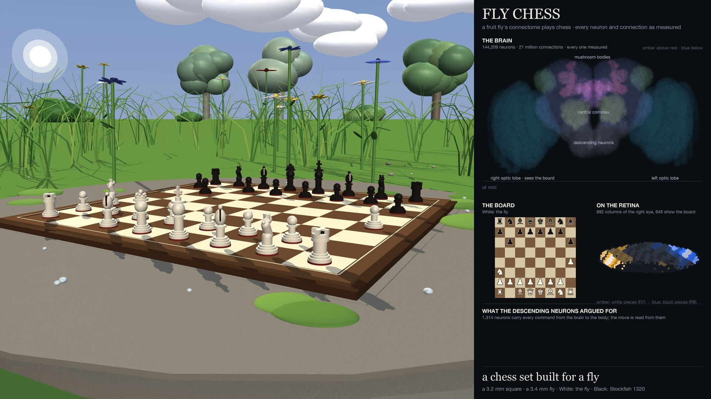
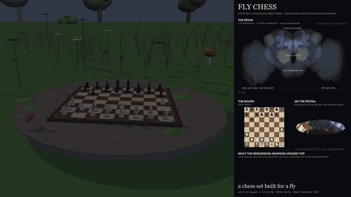
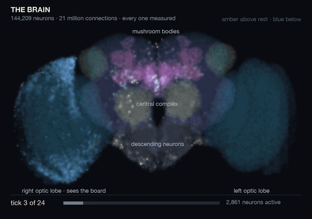
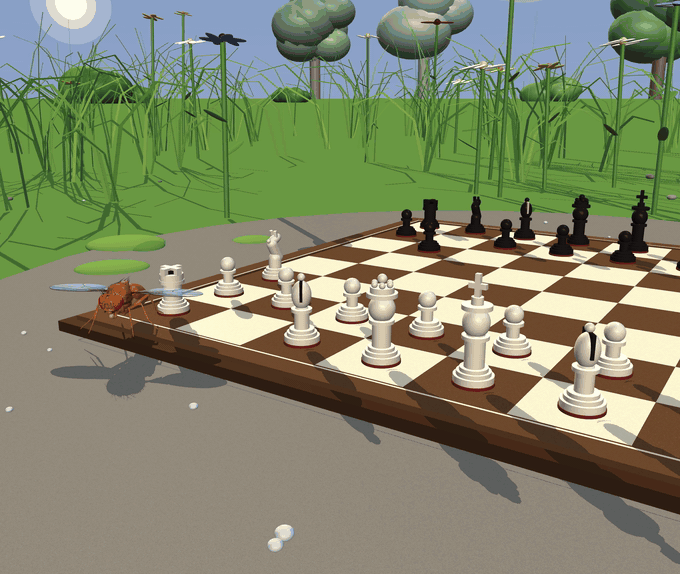
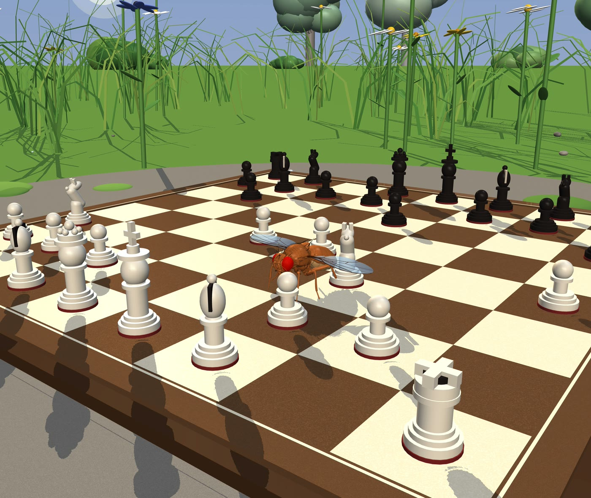
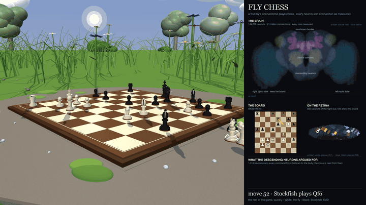
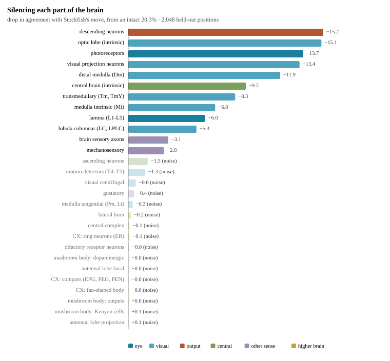
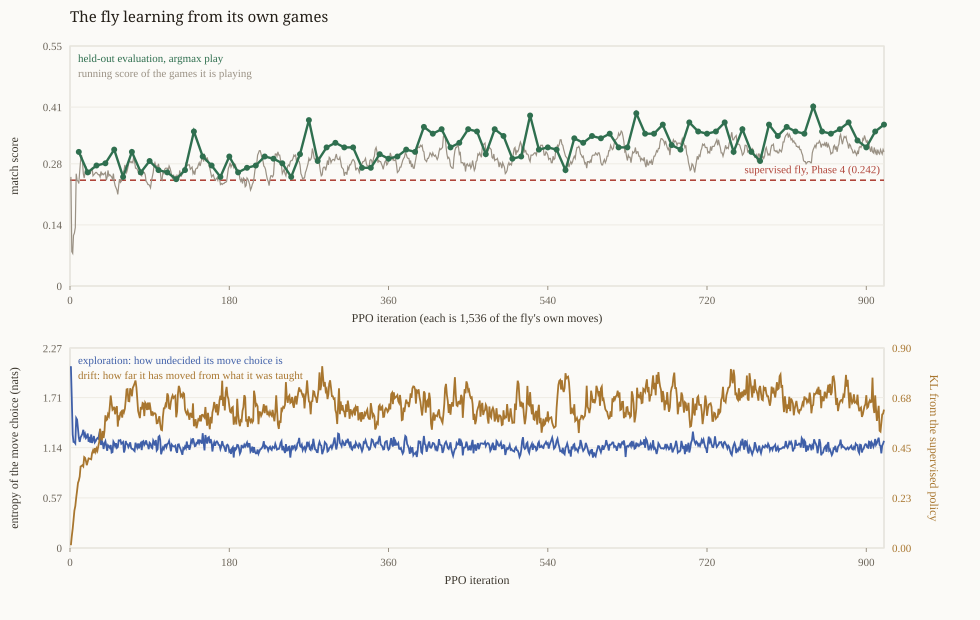
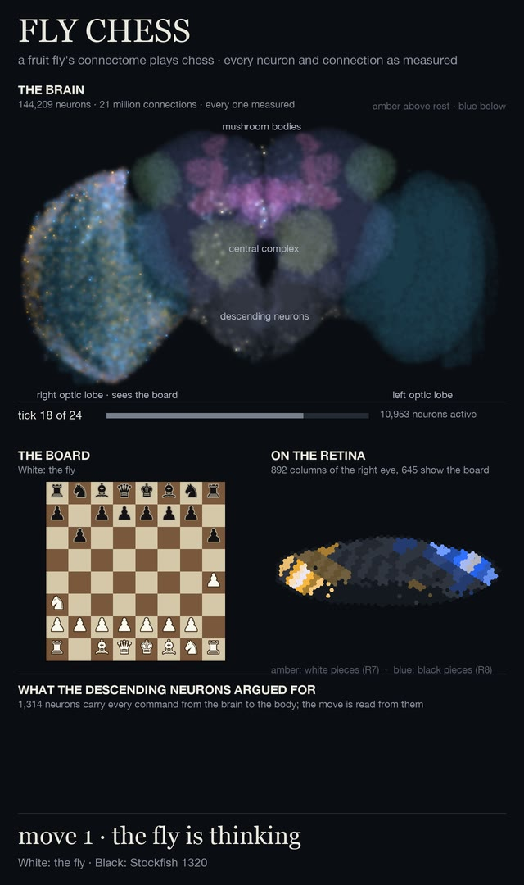

# Fly Chess

Teaching the fruit fly's wiring diagram to play chess.



A living fruit fly cannot play chess. Its complete wiring diagram, the MaleCNS connectome
published by Janelia, Cambridge and Google Research in September 2026, can be made to try.
This project keeps every neuron, every connection and every connection sign exactly as
measured, learns only the connection strengths the connectome does not measure, shows the
board to the fly's photoreceptors, and reads its move from the descending neurons that carry
every command from the real fly's brain to its body.

The full plan is in [PLAN.md](PLAN.md) (seven phases, all finished). Status:

| phase | | result |
|---|---|---|
| 0 | Know the data | done |
| 1 | Build the digital fly | done: 144,209 neurons, 21.27 M signed connections, passes both biology checks |
| 2 | Show it the board | done: the medulla reads 100.0% of squares, the retinotopic readout 99.98% |
| 3 | Teach it the rules | done: 6.2 M positions, 79.3% legal, 24.0% agreement with the move played |
| 4 | Make it play | done: a UCI engine; it beats a random mover 0.67, loses to a greedy capture bot 0.31 |
| 5 | Look inside | done: the chess lives in the visual pathway; the mushroom bodies, central complex and lateral horn can be silenced without changing a move |
| 6 | The demo | done: a garden with sun, trees and flowers around a fly-scale chess set; the fly plays Stockfish and moves its own pieces while its brain lights up beside it (rendered film; no interactive human play) |
| 7 | Learn from its own games | done: a PPO pipeline; 1.41 M self-played moves taught it to draw, not to win |

**The short version of the result.** A fly's connectome, with only its unmeasured connection
strengths learned, can be made to play legal, weak, recognisable chess. The ability lives
mostly in its visual pathway — silencing the optic lobe destroys it, silencing the central
brain leaves about half of it — and the anatomy, not the optimiser, does the work: after training, the
rank order of connection strengths still matches the measured synapse counts at Spearman 0.948.
Reinforcement learning on top of that made the fly harder to beat and worse at winning, because
the reward paid for not losing material and a policy that cannot calculate buys that with draws.

## The demo

The fly plays a real game against Stockfish and physically moves its own pieces. Nothing in the
film is simulated but the brain: the position is painted on the retina of the right eye, 144,209
neurons run for 24 ticks, and the move is read from the 1,314 descending neurons. The walk is
animation. `python -m flybrain.demo` plays and films a game; the full film is on the
[release](https://github.com/HakimElAyoubi/fly-chess/releases).

<p align="center">
  
</p>

| the fly thinks | the fly moves |
|---|---|
|  |  |
| *Every neuron's activity drawn on the head's 106 neuropils, amber above rest and blue below. The lobe that sees the board lights first.* | *Move 1, e4. The piece is carried; a captured piece would be carried off the board first.* |

<p align="center">
  
</p>

<p align="center">
  
</p>

*After the first twelve plies the rest of the game is fast-forwarded to its real end. In the filmed game Stockfish (Elo 1320) mates the fly on move 48.*

Two figures from the phases behind the film: the ablation map (silence a group of neurons, measure
what is left of the chess) and the reinforcement-learning curve.

| where the chess lives | learning from its own games |
|---|---|
|  |  |

## What is here

- `viewer.html` — the Cloud Atlas: an interactive 3D point cloud of all 108 neuropils of the
  male fly's brain and nerve cord, 140,024 neuron cell bodies, plain-language notes on every
  region, and playback of the digital fly's simulated activity. Open it in any browser.
- `flybrain/` — Phase 1: the connectome-constrained brain model (144,209 neurons, 21.27 M
  signed connections), the two biology checks it passes, and the activity export. See
  [flybrain/README.md](flybrain/README.md) for the model, the results and its known limitation.
- `flybrain/scene.py`, `flybrain/panel.py`, `flybrain/demo.py` — Phase 6: the garden (sun,
  clouds, trees, flowers, a mossy stone), the fly-scale chess set, the side panel (the brain lit
  by its activity, the board as the retina receives it, the candidate moves), and the film in
  which the fly plays a real game against Stockfish and physically moves its pieces.
  `python -m flybrain.scene` renders a still; `python -m flybrain.demo` plays and films a game.

  
- `flybrain/env.py`, `flybrain/rl.py` — Phase 7: the reinforcement-learning pipeline (batched
  chess environment, PPO with a critic on the descending neurons and a KL anchor to the
  supervised policy). `render_rl.py` draws the learning curve.
- `build_cloud.py`, `build_viewer.py`, `viewer_template.html` — how the atlas is built.
- `MALECNS_NOTES.md` — reference notes on the dataset: papers, numbers, bucket layout, schemas.
- `data/` — small derived results (`checks.json`, `spectrum.json`, `graph_brain_summary.json`,
  `activity.json`, `cloud.json`). The raw tables are not committed; they are public and the
  notes say where to get them.

## Quick start

```bash
python3 -m venv .venv && source .venv/bin/activate
pip install cloud-volume numpy pandas pyarrow scipy torch
# fetch the three v1.0 tables listed in MALECNS_NOTES.md into data/, then:
python -m flybrain.graph            # signed sparse matrix of the brain
python -m flybrain.checks           # biology checks + gain calibration
python -m flybrain.export_activity  # activity frames for the atlas
python build_viewer.py              # -> viewer.html
```

Playing the fly, and training it on its own games:

```bash
./fly-uci                                        # a UCI engine: point any chess GUI at it
python -m flybrain.play --opponent greedy --games 400
python -m flybrain.rl --opponent greedy --hours 2.5 --device cuda
python render_rl.py                              # -> data/rl_curve.svg
```

## Weights

Trained weights are not in the repository — the supervised model is 103 MB and the
reinforcement-learning checkpoint 155 MB. They are attached to the release. Everything needed to
reproduce them from the public connectome tables is here.

## Data and credit

All connectome data is MaleCNS v1.0 (Berg et al., *Cell*, 2026), released under CC-BY by the
Janelia FlyEM Project Team, the Drosophila Connectomics Group at Cambridge and Google Research:
https://male-cns.janelia.org. The modelling approach follows Shiu et al. (*Nature*, 2024) and
Lappalainen et al. (*Nature*, 2024).

Hakim El Ayoubi, 2026.
